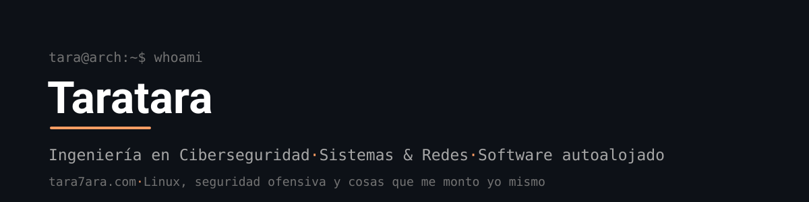

  

Estudiante de Ingeniería en Ciberseguridad (ENTI-UB, 3.º) y técnico de sistemas y redes. Me muevo entre Linux, software autoalojado y herramientas de seguridad, con un homelab propio donde corre casi todo lo que ves por aquí. Arch Linux a diario, vibecoder, pero entiendo lo que construyo porque lo uso a diario.

Portfolio y CV -> **[tara7ara.com](https://tara7ara.com)**

### En qué ando

- Ciberseguridad ofensiva y pentesting (estudiando para el eJPT)
- Linux, Bash y scripting de sistemas
- Python, FastAPI y SQLite
- Centrado en 3.º de grado; abierto a propuestas puntuales que aporten valor

### Proyectos

- **[TaraTrack](https://github.com/Tara7ara/TaraTrack)** — tracker autoalojado y multiusuario de series, pelis y anime con un motor de afinidad propio (percentiles, media geométrica y backtesting) en vez de la típica nota media.
- **[TaraScan](https://github.com/Tara7ara/TaraScan)** — navaja suiza de recon y pentesting en Python: lanza nmap, nuclei, gobuster y compañía en paralelo y unifica la salida, mapea la red local (MAC/fabricante), y suma subcomandos ofensivos y un copiloto de IA.
- **[TarArch](https://github.com/Tara7ara/TarArch)** — mi escritorio Arch Linux + Hyprland a medida, con más de un bug de NVIDIA/Wayland cazado por el camino.
- **[Tatami Shell](https://github.com/Tara7ara/Tatami_Shell)** — honeypot de terminal Linux que simula un Ubuntu, registra lo que hace el atacante y clasifica la fase del ataque. Proyecto en grupo de la carrera.

### Stack

- **Seguridad** — Nmap, Nuclei, Burp Suite, Metasploit, Wireshark, OWASP Top 10
- **Sistemas e infra** — Linux (Arch/Debian), Windows Server, Docker, Wazuh SIEM, AdGuard/Unbound
- **Desarrollo** — Python, FastAPI, HTMX, Bash, SQLite, Pytest, Git
- **Redes y firewall** — FortiGate, WireGuard, iptables, Cloudflare Zero Trust

### Contacto

- Web y CV -> [tara7ara.com](https://tara7ara.com)
- LinkedIn -> [LinkedIn](https://www.linkedin.com/in/mart%C3%AD-tarras%C3%B3n/)
